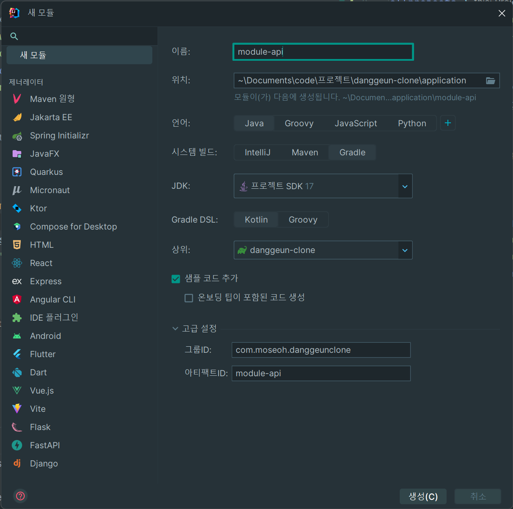
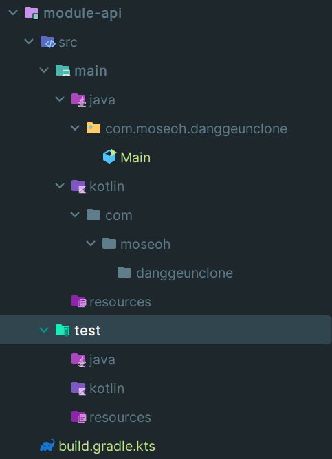
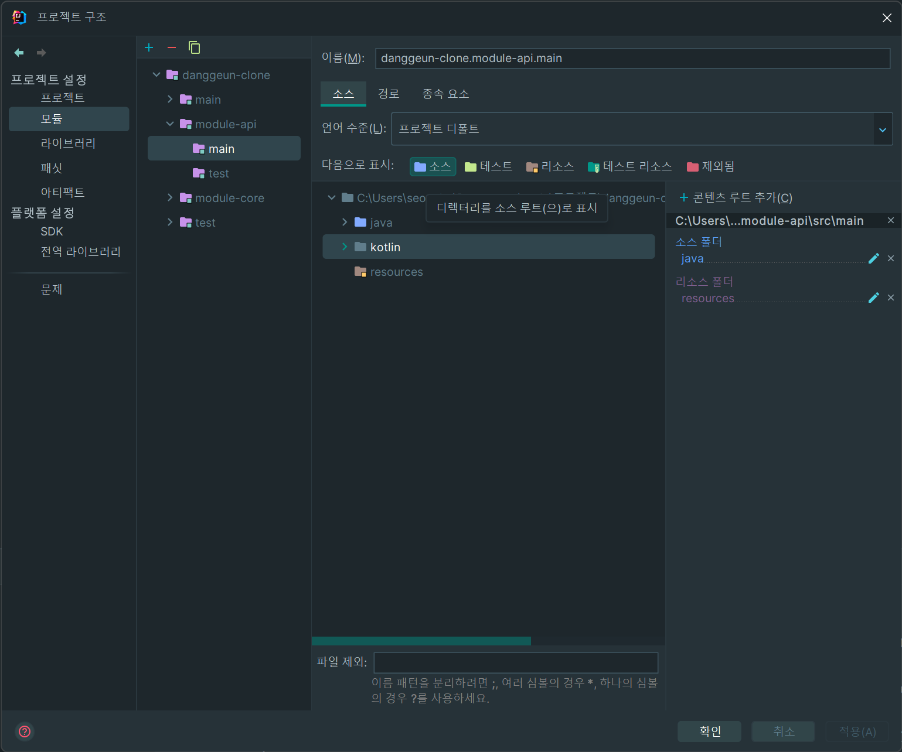

# 멀티 모듈

## 멀티 모듈의 필요성

## 멀티 모듈 구성하기

kotlin gradlew 모듈은 2023-07-27 기준으로 비활성화 되어있다고 한다.\
이 때문에 gradle-java 로 모듈을 만들고 kotlin 설정을 해주었다.

참조:\
https://youtrack.jetbrains.com/issue/IDEA-296699/New-module-wizard-There-is-no-option-to-create-Kotlin-module

### 1. 모듈 생성

gradle-java로 모듈을 생성한다.



### 2. kotlin 폴더 추가

java로 생성된 소스 폴더 그래도 kotlin을 만들어준다.



### 3. 소스 폴더 지정

기존 java로 지정된 소스 폴더를 kotlin으로 바꿔준다.\
test 폴더도 동일하게 바꿔준다.



## build.gradle 설정

아래 목록에 따라 sub project 간의 의존성을 분리하기 위해 각각의 gradle을 정의하였다.

- root project의 gradle 에서는 공통으로 사용되는 기본적인 설정을 정의한다.
- sub project의 gradle 에서는 각각의 sub project가 사용할 값을 정의한다.
    - sub project의 gradle 에서 실제 배포되는 module 만 bootJar로 만들 수 있도록 한다.
    - BootJar 은 Spring Boot 애플리케이션을 실행 가능한 jar 파일로 패키징하며 Main 클래스가 사용된다.
    - Jar은 일반적인 Java 애플리케이션의 배포 단위인 jar 파일을 생성한다.

### root project

- 공통 설정을 정의한다.
- 아래 설정된 값(버전 관리 등)을 따로 적용하고 싶다면 sub project에서 작성하도록 한다.

```kotlin
import org.jetbrains.kotlin.gradle.tasks.KotlinCompile

plugins {
    kotlin("jvm") version "1.9.0"
}

allprojects {
    group = "com.moseoh"
    version = "0.0.1-SNAPSHOT"

    repositories {
        mavenCentral()
    }

    apply {
        plugin("java")
        plugin("kotlin")
    }

    tasks.withType<KotlinCompile> {
        kotlinOptions {
            freeCompilerArgs += "-Xjsr305=strict"
            jvmTarget = "17"
        }
    }

    tasks.withType<Test> {
        useJUnitPlatform()
    }

    java {
        sourceCompatibility = JavaVersion.VERSION_17
    }

    dependencies {
        // kotlin
        implementation("org.jetbrains.kotlin:kotlin-reflect")
    }
}
```

### subproject

- 각각의 모듈에서 사용할 dependency, plugin 들을 설정한다.
- main 클래스로 실행될 api module만 bootJar로 배포된다.
- sub project 간의 의존성이 필요한 경우 dependency를 추가한다.

module-api:

```kotlin
description = "module-api"

plugins {
    id("org.springframework.boot") version "3.1.2"
    id("io.spring.dependency-management") version "1.1.0"
    id("org.asciidoctor.jvm.convert") version "3.3.2"
    kotlin("plugin.spring") version "1.9.0"
}

dependencies {
    // module 추가
    implementation(project(":module-core"))
    implementation(project(":module-auth"))

    // spring web
    implementation("org.springframework.boot:spring-boot-starter")
    implementation("org.springframework.boot:spring-boot-starter-web")

    // test
    testImplementation("org.springframework.boot:spring-boot-starter-test")
}

```

module-auth:

```kotlin
import org.springframework.boot.gradle.tasks.bundling.BootJar

description = "module-auth"

plugins {
    id("org.springframework.boot") version "3.1.2"
    id("io.spring.dependency-management") version "1.1.0"
    id("org.asciidoctor.jvm.convert") version "3.3.2"
    kotlin("plugin.spring") version "1.9.0"
}

dependencies {
    // module
    implementation(project(":module-core"))

    // spring security
    implementation("org.springframework.boot:spring-boot-starter")
    implementation("org.springframework.boot:spring-boot-starter-web")
    implementation("org.springframework.boot:spring-boot-starter-security")

    // test
    testImplementation("org.springframework.security:spring-security-test")
}

// 독립적으로 실행되지 않으므로 jar 배포
tasks {
    withType<Jar> {
        enabled = true
    }

    withType<BootJar> {
        enabled = false
    }
}
```

module-core:

```kotlin
import org.springframework.boot.gradle.tasks.bundling.BootJar

description = "module-core"

plugins {
    id("org.springframework.boot") version "3.1.2"
    id("io.spring.dependency-management") version "1.1.0"
    kotlin("plugin.spring") version "1.9.0"
    kotlin("plugin.jpa") version "1.9.0"
}

dependencies {
    // spring jpa
    implementation("org.springframework.boot:spring-boot-starter")
    implementation("org.springframework.boot:spring-boot-starter-data-jpa")

    // database
    implementation("mysql:mysql-connector-java:8.0.32")
    testImplementation("com.h2database:h2:2.2.220")

    // test
    testImplementation("org.springframework.boot:spring-boot-starter-test")
}

// 독립적으로 실행되지 않으므로 jar 배포
tasks {
    withType<Jar> {
        enabled = true
    }

    withType<BootJar> {
        enabled = false
    }
}
```

## Dependency

### api vs implementation

이 둘의 차이는 무엇일까?

module-api <- module-core 의 종속성을 갖을 때, module-core에서 종속성을 설정하는 방법에 따라 아래의 경우로 나누니다.

- api
    - api의 모듈이 core 모듈의 dependency를 사용할 수 있게 한다.
- implementation
    - api의 모듈이 core 모듈의 dependency를 사용할 수 없다. core에서만 종속됨.

의존성을 최소화하기 위해 `implementation`를 주로 사용할 것 같다.

## Scan

나의 프로젝트 의존 구조는 아래와 같다.

- com.moseoh.danggeunclone.api (main)
    - com.moseoh.danggeunclone.core
    - com.moseoh.danggeunclone.auth
        - com.moseoh.danggeunclone.core

dependency를 통해 주입된 모듈의 클래스들을 사용할 수 있지만, Spring이 하위 모듈을 전부 스캔하지 않는다.

### ComponentScan, EntityScan

core 모듈에서 작성한 `@Entity`, `@Configuration`, auth 모듈에서 작성한 여러 Component 등을 사용하기 위해 main 클래스가 정의된 api 모듈에서 Sacn을 추가한다.

```kotlin
@SpringBootApplication
@ComponentScan("com.moseoh.danggeunclone")
// @ComponentScan(basePackages = ["com.moseoh.danggeunclone.auth", "com.moseoh.danggeunclone.core"])
@EntityScan("com.moseoh.danggeunclone.core")
class DanggeunCloneApplication
```

com.moseoh.danggeunclone 하위에 세개의 모듈이 있기 때문에 위처럼 작성해도 되고, 하나씩 지정해도 된다.\
entity의 경우는 core에만 정의되어있기 때문에 core로 명시하였다.

